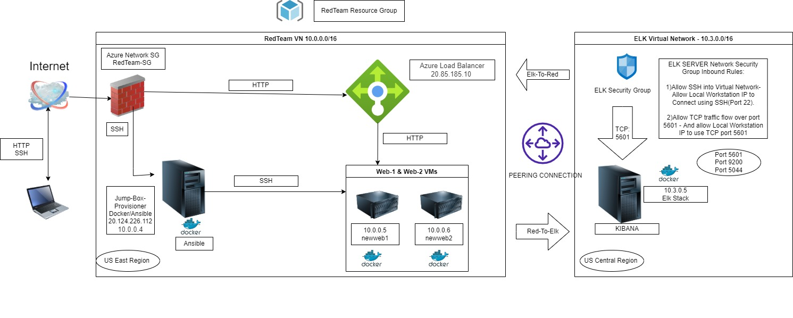

## Automated ELK Stack Deployment

The files in this repository were used to configure the network depicted below.

These files have been tested and used to generate a live ELK deployment on Azure. They can be used to either recreate the entire deployment pictured above. Alternatively, select portions of the _____ file may be used to install only certain pieces of it, such as Filebeat.

This document contains the following details:
-	Description of the Topology
-	Access Policies
-	ELK Configuration
o	Beats in Use
o	Machines Being Monitored
-	How to Use the Ansible Build

Description of the Topology
The main purpose of this network is to expose a load-balanced and monitored instance of DVWA 

Load balancing ensures that the application will be highly available. The use of a load-balancer ensures the machines are not directly accessible from the internet, and protected from unauthorized SSH access from outside the network. Moreover, load balancers can also be configured to limit the access of the particular servers to prevent penetration by hackers. The use of the jump box ensures we can only access the other machines from the docker container running within. Using Jumpbox we are accessing newweb1 and newweb2.

Integrating an ELK server allows users to easily monitor the vulnerable VMs for changes to the VM metrics and system logs. The Metricbeat and Filebeat modules were installed on the ELK VMs, and monitor the following:

•	Filebeat: Monitors system logs on the machines. It helps to detect changes to certain important files. for example accessing etc/passwd file
•	Metricbeat: Monitors VM metrics, including network I/O, CPU usage, CPU load, uptime information and memory pressure and then sends it to Elasticsearch on ELK server. 

The configuration details of each machine may be found in the table below:

Name	Function	Operating System	IP Address
JumpBox	Gateway	Linux (ubuntu 20.04)	10.0.0.4
20.124.226.112
Newweb1	Process and deliver content to user	Linux (ubuntu 20.04)	10.0.0.5
Newweb2	Process and deliver content to user	Linux (ubuntu 20.04)	10.0.0.6
Elk	Collect and process data from Web VMs	Linux (ubuntu 20.04)	10.3.0.5
RedTeamLB
	Distribute Traffic to backend server pool	Linux (ubuntu 20.04)	20.85.185.10
Local Workstation
	Configuration network externally	Windows 10 Home	68.206.66.79 

Access Policies

Machines on the internal network are not exposed to the public internet.

Only the Jump-Box-Provisioner machine(gateway) can accept connections from the internet. Access to this machine is only allowed from the following IP addresses:

68.206.66.79

Machines within the network can only be accessed by the Jump Box, which has the IP address 10.0.0.4

A summary of the access policies is shown below.
Name	Publicly Accessible	Allowed IP Addresses
JumpBox	Yes	Local Workstation with IP 68.206.66.79 via SSH port 22 
Newweb1	No	10.0.0.5 via SSH port 22
Newweb2	No	10.0.0.6 via SSH port 22
Elk	Only on port 5601	Local Workstation with IP 68.206.66.79 via port 5601,
10.0.0.5, 10.0.0.6
RedTeamLB
	Yes	Local Workstation with IP 68.206.66.79 via HTTP port 80

Elk Configuration

Ansible is an open-source software provisioning, configuration management, and application-deployment tool enabling infrastructure as code. Ansible used to automate configuration of the ELK machine. 

The main benefits of the ansible are saving time and Playbooks are written in YAML. With the help of the Ansible, time require to configure the process is less than 15 minutes. Ansible is agentless. i.e It does not require any software of firewall ports on the client systems to automate. 

The playbook implements the following tasks:

sudo apt update (ensure system is updated)
sudo apt install -y docker.io (bring in docker)
sudo systemctl status docker (verify docker is running)
sudo docker pull cyberxsecurity/ansible:latest (download container)
sudo docker container list -a (list all installed docker containers)

The following screenshot shows the result of running docker ps after successfully configuring the ELK instance.

 

Target Machines & Beats

This ELK server is configured to monitor the following machines:
IP addresses 
•	10.0.0.5
•	10.0.0.6

We have installed the following Beats on these machines:

Filebeat: Filebeat collects and aggregates various log events regarding the file systems on a host.
Metricbeat: Metricbeat reports on the health of a system and collects various machine metrics such as uptime, memory usage, and Network I/O.

Using the Playbook

In order to use the playbook, you will need to have an Ansible control node already configured

SSH into the control node and follow the steps below:

•	Copy the filebeat-config.yml file to /etc/ansible/files/filebeat-config.yml.

•	Update the filebeat-config.yml file to include the installation path, username/password, the IP address of the ELK server under outpout.elasticsearch within the configuration file, and the IP address and port number under the setup.kibana field.

•	Run the playbook, and navigate to http://104.43.141.101:5601/app/kibana to check that the installation worked as expected. To confirm that the ELK server is receiving logs from Web-1 and Web-2 you will navigate from within the Kibana GUI to Add Log Data --> System Logs --> DEB tab --> Step 5: Module Status --> Check Data.

•	Which file is the playbook? Where do you copy it? File : filebeat-playbook.yml. It will be copied in the /etc/ansible/roles/filebeat-playbook.yml directory.

•	Which file do you update to make Ansible run the playbook on a specific machine? How do I specify which machine to install the ELK server on versus which to install Filebeat on? Ansible Hosts file(/etc/ansible). Under the "webservers" grouping, Lists the VM's that will be configured with Filebeat. Also, in the same file create a group "elk" , to specify the VM that will be configured with the ELK server.

•	Which URL do you navigate to in order to check that the ELK server is running? http://104.43.141.101:5601/app/kibana

Bonus

•	ssh azadmin@20.124.226.112
•	sudo docker pull (name of container)- to download container
•	sudo docker run -ti (name of container) bash
•	sudo docker container list -a 
•	sudo docker start peaceful_hermann - to start the container
•	sudo docker attach peaceful_hermann - to connect to the Ansible container 
•	cd /etc/ansible
•	nano hosts - configure the IP addresses within the ‘webserver’ and ‘elk’ groups
•	nano ansible.cfg - the remote user
•	ansible-playbook - name of the playbook
